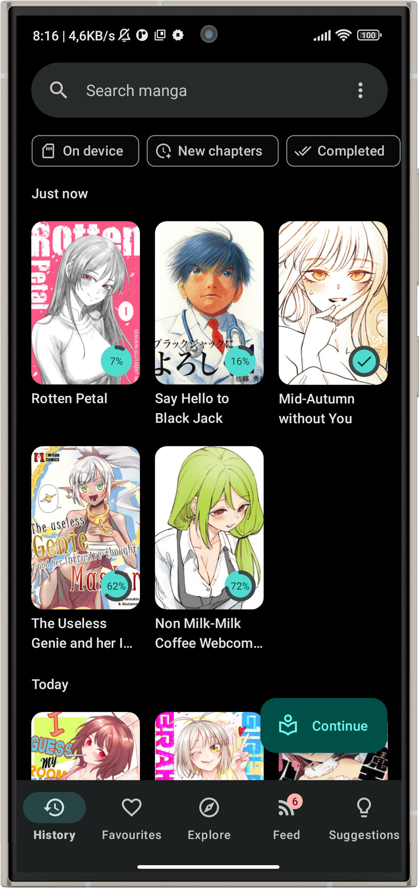
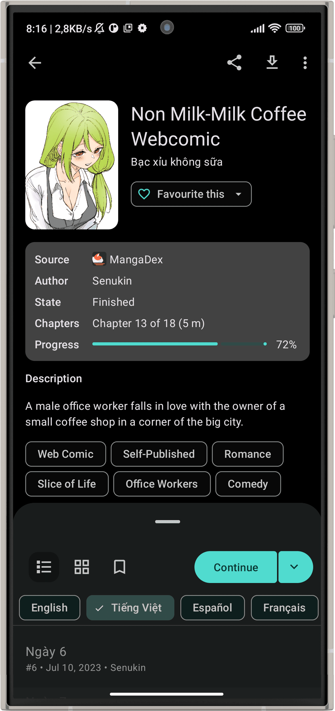
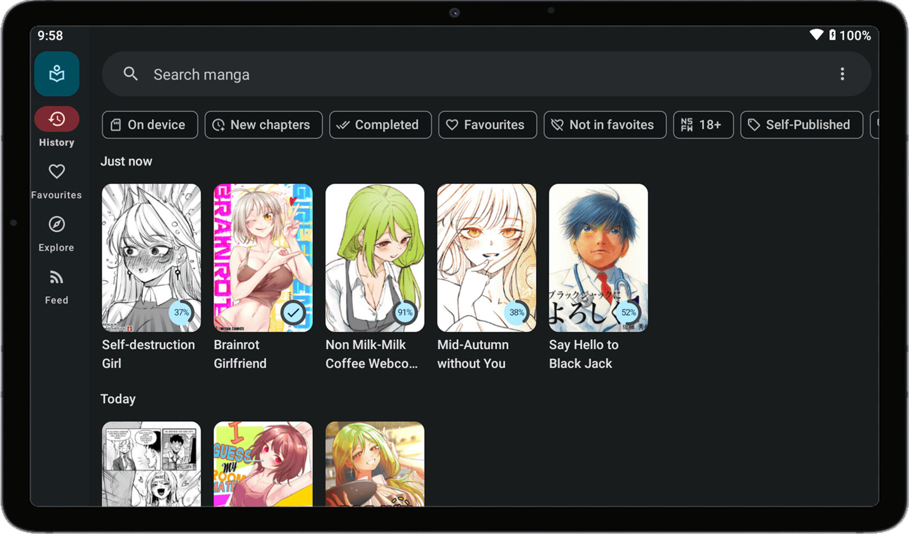
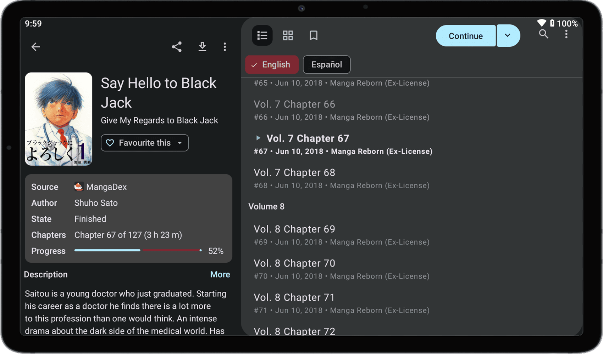

<div align="center">
  <a href="https://github.com/Ero-gamer/support-palestine-banner/blob/master/Markdown-pages/Support.md">
    
  </a>
</div>

<br>

<div align="center">
  
</div>

<br>

<div align="center">

[](https://github.com/Ero-gamer/Weeber)
[](https://github.com/Ero-gamer/Weeber/blob/main/LICENSE)
[](https://github.com/Ero-gamer/Weeber)
[](https://github.com/Ero-gamer/Weeber/stargazers)
[](https://github.com/Ero-gamer/Weeber/network)
[](https://github.com/Ero-gamer/Weeber/releases)
[](https://github.com/Ero-gamer/Weeber/releases/latest)

</div>

<br>

<div align="center">

> **Weeber** is a free, lightweight, open-source manga · webtoon · manhua reader for Android.
> Built on [Kotatsu Redo](https://github.com/Kotatsu-Redo/Kotatsu-redo) and enriched with the best features
> from Kotatsu ecosystem — plus Mihon extensions support, an in-app Browser Source,
> and 1200+ built-in manga sources.

</div>

---

## ✨ Features at a Glance

<div align="center">

| 📚 Content | 🎨 Experience | 🔧 Utility |
|:---:|:---:|:---:|
| 1400+ built-in sources | Material You UI | Cross-device sync |
| Mihon extension support | Standard + Webtoon reader | Password / fingerprint lock |
| In-app Browser Source | Gesture controls | Resumable offline downloads |
| Search by name & genre | Tablet & desktop optimized | CBZ archive support |
| Favorites & categories | Gapless page transitions | Android 6.0+ |
| Incognito mode | New chapter notifications | Tracker integrations |

</div>

<details>
<summary>📋 Full features list</summary>
<br>

**Sources & discovery**
- 📚 **1400+ built-in manga sources** — search by name, genre, content rating and more
- 🔌 **Mihon / Tachiyomi extensions** — install any compatible APK extension; auto-detected on startup
- 🌐 **Browser Source** — browse any manga site in-app; reader auto-detects chapters
- 🔍 **Extension repositories** — add Mihon-compatible repos (e.g. Keiyoushi) to install extensions

**Library & reading**
- ⭐ **Favorites & history** — user-defined categories, bookmarks and incognito mode
- 📥 **Offline reading** — resumable chapter downloads, CBZ archives supported
- 📖 **Customizable reader** — standard & webtoon modes, full gesture support, gapless pages
- 📝 **Favourites reorder** — drag-and-drop reordering of favourites list

**Discovery & updates**
- 🔔 **Notifications** — new chapter alerts, updates feed and filtered recommendations
- 💡 **Background update checks** — automatic GitHub release checks with skip-version support
- 🏷️ **Source health tracking** — automatically tracks and surfaces unreliable sources

**Integrations**
- 🔗 **Tracker integration** — Shikimori, AniList, MyAnimeList, Kitsu with offline scrobble queue
- 🌍 **FlareSolverr support** — bypass Cloudflare challenges via your own FlareSolverr instance
- 🛡️ **Censorship bypass** — built-in SNI/TLS bypass tunnel for blocked networks

**Privacy & safety**
- 🔒 **Privacy** — password / fingerprint protection
- 🚨 **Crash reporter** — robust crash handler with separate process and full device report
- 🖼️ **Clean error UX** — failed covers show a calm placeholder instead of raw HTTP codes

**Performance**
- ⚡ **Database indexes** — optimized indexes on library, history, tags and stats tables
- 🗄️ **DB optimizer** — auto-ANALYZE every session, VACUUM when fragmentation is detected
- 🌡️ **Bandwidth tracking** — passive per-response speed measurement, no background polling
- 🔗 **WebView perf** — hardware acceleration, stripped bot-score UA token, pre-warmed DNS

**System**
- 🔄 **Cross-device sync** — automatic sync across devices
- 📱 **Legacy support** — Android 6.0+

</details>

---

## 🆕 Imported / Added Features

<details>
<summary>Click to expand — what Weeber adds on top of Kotatsu Redo</summary>
<br>

These features were imported, merged, and adapted from the Kotatsu ecosystem:

### 🔌 Extension Systems
| Feature | Source |
|---|---|
| **Mihon / Tachiyomi APK extension support** — full bridge layer, auto-detection of installed extensions, `ChildFirstPathClassLoader`, `MihonInjektBridge` | Kaisoku |
| **Extension repository manager** — add Mihon-compatible repos (e.g. `keiyoushi/extensions`), browse and install extensions in-app | Kaisoku |
| **Custom JAR plugin system** — load custom `.jar` parser plugins from device storage | Usagi |
| **Plugin manager UI** — list, import (local file / GitHub release), delete and auto-update JAR plugins | Usagi + Kaisoku |
| **Browser Source** — in-app browser that auto-detects manga chapters; taps into `CustomMangaRepository` | Kaisoku |
| **External source cover fetcher** — Coil3 fetcher using Mihon extension's own OkHttpClient + headers for cover images | Usagi 0.0.32 |

### 🌐 Network
| Feature | Source |
|---|---|
| **FlareSolverrInterceptor** — opt-in Cloudflare bypass via external FlareSolverr server | Kaisoku |
| **BypassProxyServer** — full TLS/SNI splitting loopback proxy for DPI bypass | Kaisoku |
| **Improved Cloudflare auto-solver** — `CloudFlareState`, `CloudflareSolver`, `IframeInfo` with iframe detection | Kaisoku |
| **BandwidthTrackingInterceptor** — passive bandwidth measurement via `ForwardingSource`, decoupled from polling | Yumemi |
| **ProxyBlacklistManager** — 6h-TTL SharedPreferences blacklist for image proxy hosts that return 403/451 | Yumemi |
| **ConnectionWarmer** — fires a HEAD request before BrowserSource opens to pre-warm DNS | Tsuki (Futon) |
| **WebViewPerformanceConfigurator** — hardware layer, HIGH render priority, Safe Browsing off, UA bot-score fix | Tsuki (Futon) |

### 📖 Reader
| Feature | Source |
|---|---|
| **ChapterSwitchCursor** — deterministic rapid chapter prev/next navigation (prevents race conditions) | Kaisoku |
| **WebtoonPageSizeCache** — per-page height caching for accurate webtoon scroll tracking | Kaisoku |
| **GaplessPageTransformer** — removes gaps between standard reader pages | Yumemi |
| **Drag-to-select in lists** — rubber-band multi-select via touch drag | Usagi |

### 🗄️ Database & Performance
| Feature | Source |
|---|---|
| **DatabaseOptimizer** — `ANALYZE` every session, `VACUUM` when fragmentation >20% AND 7+ days since last | Yumemi |
| **DB query indexes** — indexes on tags, favourites, scrobblings, track_logs, stats, local_index, source_health | Yumemi v9.4.11 |
| **ListDiffExecutor** — dedicated 2-thread pool for `DiffUtil` at lower priority | Kaisoku |

### 🔔 Notifications & Updates
| Feature | Source |
|---|---|
| **AppUpdateCheckWorker** — periodic background GitHub release check with WiFi-only, battery-low guards | Yumemi |
| **AppUpdateNotifier** — notification with changelog excerpt and skip-version action | Yumemi |
| **Offline scrobble queue** — `ScrobbleOfflineQueue` + `ScrobbleQueueWorker` with 7-day TTL and dedup | Yumemi |

### 🚨 Crash System
| Feature | Source |
|---|---|
| **GlobalCrashHandler** — installs as default uncaught exception handler, OOM-safe | Kaisoku |
| **CrashService** — separate `:crash` process with foreground service, full device report, clipboard copy | Kaisoku |
| **CrashReportFormatter** — formats OS, device, app version, stack trace into shareable GitHub issue URL | Kaisoku |

### 🎨 UI & UX
| Feature | Source |
|---|---|
| **Favourites drag-reorder** — `FavouritesReorderCallback` + `FavouritesTouchListener` | Usagi |
| **ProgressButton widget** — animated fill progress button for plugin/download UI | Usagi |
| **Clean error covers** — failed covers show a neutral placeholder icon instead of raw HTTP codes | Yumemi |
| **HapticExt** — `performHapticFeedbackCompat()`, `performTickHaptic()` — API 30+ semantic constants | Tsuki (Futon) |
| **OnContextClickListenerCompat** — `fun interface` for right-click / stylus support | Usagi |

### 📥 Downloads
| Feature | Source |
|---|---|
| **ResumableDownloader** — HTTP Range request support: HEAD check, resume with `Range: bytes=N-`, 206/416/200 handling | Yumemi |
| **DownloadStateTracker** — page-level download progress persistence, 7-day TTL cleanup | Yumemi |

### 📊 Stats
| Feature | Source |
|---|---|
| **DST-safe reading streak** — uses `Calendar.add(DAY_OF_YEAR, -1)` instead of fixed 86,400,000 ms subtraction | Yumemi v9.4.11 |
| **Streak card always visible** — streak card no longer disappears when selected period has no data | Yumemi v9.4.11 |

### 🏥 Source Health
| Feature | Source |
|---|---|
| **SourceHealthTracker + SourceHealthManager** — DB-backed success/failure tracking, rolling average response times | Yumemi |

### ⚙️ Settings & Prefs
| Feature | Source |
|---|---|
| **DownscaleMode** — per-mode image resolution downscale setting | Usagi |
| **isWebtoonMemorySaver** — caps live decoded pages and disables prefetch on constrained devices | Next (original) |

</details>

---

---

## ⭐ Weeber Original Unique Features:

These features were built from scratch for Kotatsu Next / Weeber.

- **Vibrance & Sharpening image filters** — Vibrance restores washed-out colors while preserving natural tones, perfect for manhua, webtoons and colored manga. Sharpening makes blurry or bad scans look crisp and detailed. (Experimental, resource-intensive — use with caution)
- **Denoise, Dither & Grain image filters** — Additional CPU-based image filters. All filters applied per-tile inline post-decode via `ThreadLocal` IntArray pools — zero GC pressure.
- **JPEG Turbo decoder** — Replaced the default JPEG decoder with libjpeg-turbo via JNI. Decodes error-free even for images larger than 10000×5000 px that produce visible tint artifacts in the stock decoder. 2×–6× faster with equal or lower memory overhead.
- **Increased max zoom ×2 + 3-step double-tap zoom cycle** — Max pinch/scroll zoom doubled. Double-tap cycles through 3 zoom levels. Ideal for high-resolution manhua and detailed scans.
- **Vertical slider reader control** — Optional vertical slider for manual position navigation in the reader.
- **Webtoon memory saver mode** — Opt-in toggle that caps live decoded pages and disables prefetch to reduce memory pressure on low-RAM devices.
- **Global toggle: disable CF captcha auto-solver** — Single setting to turn off automatic Cloudflare captcha solving for all sources at once.
- **Optimized Backup & Restore** — Faster, more reliable backup and restore flow.

---

## 📸 Screenshots

<details>
<summary>Click to show/hide screenshots</summary>

<div align="center">

### 📱 Phone




### 🖥️ Tablet




</div>

</details>

---

## ☕ Support the Project

<div align="center">

*Weeber is and always will be 100% free.*
*If you'd like to fuel development, any donation is deeply appreciated* 🙏

</div>

<br>


```
19Zks5VmhPtPPiZNHQUv71vfLyEeCtec2T
```

-168363?style=for-the-badge&logo=tether&logoColor=white)
```
TAxmtUbhiWEgY9bDQbgaaTPcmoS8EfJkKR
```


```
0x7f92c4a838286a48f007419c9707f9096dc6675d
```


```
5KCKZtKtYd9J5UB4VW3HJny4cBWKAJktmGUkfxsdsh9S
```


```
UQAN5OUU7YjxFPEPP0-LC62lWL_CF_LqgVhz9qjbvzLhb74F
```

-F0B90B?style=for-the-badge&logo=binance&logoColor=white)
```
583622748
```

---

> [!CAUTION]
> **Free and Open-Source Android is under threat.** Google will turn Android into a locked-down platform, restricting your freedom to install apps of your choice.
> Make your voice heard → [keepandroidopen.org](https://keepandroidopen.org/)

---

## 🤝 Contributing

<div align="center">

[](https://github.com/Ero-gamer/Weeber/blob/main/CONTRIBUTING.md)

</div>

Have an idea or a fix? Pull requests are welcome!
Please read [CONTRIBUTING.md](https://github.com/Ero-gamer/Weeber/blob/main/CONTRIBUTING.md) before submitting.

---

## 📄 License

<div align="center">

[](http://www.gnu.org/licenses/gpl-3.0.en.html)

</div>

You may copy, distribute and modify this software as long as you track changes/dates in source files. Any modifications to or software including (via compiler) GPL-licensed code must also be made available under the GPL along with build & install instructions.

---

<details>
<summary>⚠️ DMCA Disclaimer</summary>
<br>

The developers of this application have no affiliation with the content available in the app and do not store or distribute any content. This application should be considered a web browser — all content accessible through it is freely available on the Internet. All DMCA takedown requests should be sent to the owners of the website where the content is hosted.

</details>

---

## 🙏 Acknowledgments & Credits

<div align="center">

*Weeber stands on the shoulders of giants.*

</div>

Weeber is built upon the collective work of multiple outstanding open-source projects. Huge thanks to everyone who made this possible:

### 🏗️ Foundations

| Project | Repo | Role |
|---|---|---|
| **Kotatsu** | [KotatsuApp/Kotatsu](https://github.com/KotatsuApp/Kotatsu) | Original manga reader — the foundation everything is built on |
| **Kotatsu Redo** | [Kotatsu-Redo/Kotatsu-redo](https://github.com/Kotatsu-Redo/Kotatsu-redo) | Direct upstream fork — continued parser development |

### 🔀 Feature Sources

| Project | Repo | Contributed Features |
|---|---|---|
| **Kaisoku** | [glitch-228/Kaisoku](https://github.com/glitch-228/Kaisoku) | Mihon extension system, FlareSolverr, BypassProxyServer, BrowserSource, crash system, ChapterSwitchCursor, CloudflareSolver improvements, WebtoonPageSizeCache, ListDiffExecutor |
| **Usagi** | [UsagiApp/Usagi](https://github.com/UsagiApp/Usagi) | Custom JAR plugin system, plugin manager UI, favourites drag-reorder, DragSelectionListener, ProgressButton, DownscaleMode, OnContextClickListenerCompat |
| **Usagi 0.0.32** | [UsagiApp/Usagi](https://github.com/UsagiApp/Usagi) | ExternalSourceFetcher for Mihon extension cover images |
| **Yumemi** | [Yumemi fork](https://github.com/bento07/yumemi) | DatabaseOptimizer, ResumableDownloader, DownloadStateTracker, ScrobbleOfflineQueue, ProxyBlacklistManager, GaplessPageTransformer, AppUpdateCheckWorker, SourceHealthTracker |
| **Yumemi v9.4.11** | [Yumemi fork](https://github.com/bento07/yumemi) | DST-safe reading streak, streak card always visible, DB query indexes |
| **Tsuki / Futon** | [landwarderer/Tsuki](https://github.com/landwarderer/futon) | ConnectionWarmer, WebViewPerformanceConfigurator, HapticExt, KotatsuParserMatcher |

### 🌍 Community

| Who | Why |
|---|---|
| [Weblate translators](https://hosted.weblate.org/engage/kotatsu/) | Localizing Kotatsu for the world — translations carry forward into Weeber |
| Kotatsu community | Years of testing, bug reports, and support |

<br>

<div align="center">


</div>
